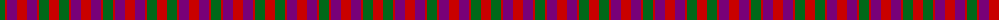
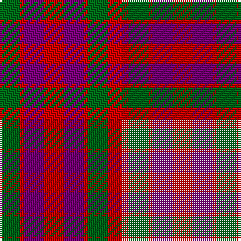

The parent of this is [Gow (Portrait)](/tartans/g/10/r2/p10/r10/p10/r2/g10/r/10/)

This was sourced from register-of-tartans.  It is a [8 stripes tartan](/stripes/stripes8/).

Original link https://www.tartanregister.gov.uk/tartanDetails.aspx?ref=1473

## Thread count
G/10 R2 P10 R10 P10 R2 G10 R/10

## Palette
Each colour and its ΔE from the base-6 reference it is a variant of.

| Colour | Shade | Base | ΔE (OKLab) |
|---|---|---|---|
| DG |  `#003820` | G  | 0.16 |
| DP |  `#440044` | B  | 0.17 |
| G |  `#006818` | G  | 0.02 |
| P |  `#780078` | B  | 0.16 |
| R |  `#C80000` | R  | 0.00 |

# Sample pattern

ID: /variants/g/10/r2/p10/r10/p10/r2/g10/r/10-dg003820-dp440044-g006818-p780078-rc80000/
