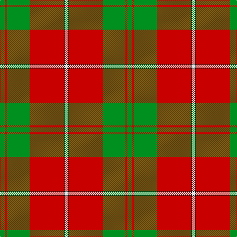

The parent of this is [Colchester & District P&D (Corporate](/tartans/g/10/r4/g46/r69/k2/ln/6/)

This was sourced from tartans-authority.  It is a [6 stripes tartan](/stripes/stripes6/).

Original link http://www.tartansauthority.com/tartan-ferret/display/10181/

## Thread count
G/10 R4 G46 R69 K2 LN/6

## Palette
Each colour and its ΔE from the base-6 reference it is a variant of.

| Colour | Shade | Base | ΔE (OKLab) |
|---|---|---|---|
| G |  `#009020` | G  | 0.14 |
| K |  `#101010` | K  | 0.17 |
| LN |  `#E0E0E0` | W  | 0.06 |
| R |  `#C80000` | R  | 0.00 |

# Sample pattern

ID: /variants/g/10/r4/g46/r69/k2/ln/6-g009020-k101010-lne0e0e0-rc80000/
