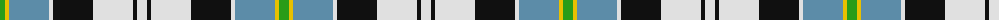

The parent of this is [Alexander Brothers - 2007? (Corp.)](/tartans/g/10/y4/b40/ln4/k40/ln40/k4/ln/10/)

This was sourced from tartans-authority.  It is a [8 stripes tartan](/stripes/stripes8/).

Original link http://www.tartansauthority.com/tartan-ferret/display/7423/

## Thread count
G/10 Y4 B40 LN4 K40 LN40 K4 LN/10

## Palette
Each colour and its ΔE from the base-6 reference it is a variant of.

| Colour | Shade | Base | ΔE (OKLab) |
|---|---|---|---|
| B |  `#5C8CA8` | B  | 0.23 |
| G |  `#289C18` | G  | 0.18 |
| K |  `#101010` | K  | 0.17 |
| LN |  `#E0E0E0` | W  | 0.06 |
| Y |  `#E8C000` | Y  | 0.00 |

# Sample pattern

ID: /variants/g/10/y4/b40/ln4/k40/ln40/k4/ln/10-b5c8ca8-g289c18-k101010-lne0e0e0-ye8c000/
