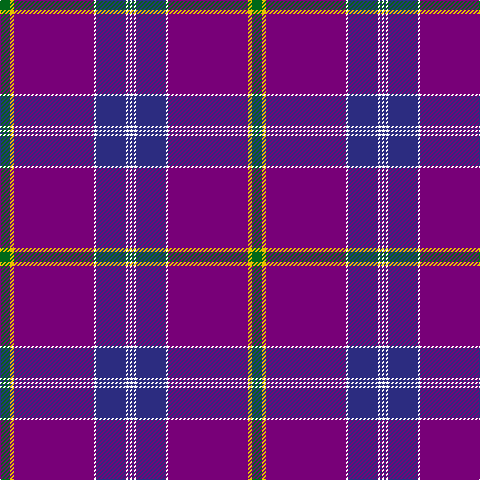

The parent of this is [Jackson (Personal)](/tartans/g/10/y4/p80/w2/db30/w2/db2/w/2/)

This was sourced from register-of-tartans.  It is a [8 stripes tartan](/stripes/stripes8/).

Original link https://www.tartanregister.gov.uk/tartanDetails.aspx?ref=4894

## Thread count
G/10 Y4 P80 W2 DB30 W2 DB2 W/2

## Palette
Each colour and its ΔE from the base-6 reference it is a variant of.

| Colour | Shade | Base | ΔE (OKLab) |
|---|---|---|---|
| B |  `#1474B4` | B  | 0.15 |
| DB |  `#2C2C80` | B  | 0.05 |
| G |  `#006818` | G  | 0.02 |
| O |  `#E86000` | R  | 0.14 |
| P |  `#780078` | B  | 0.16 |
| W |  `#FCFCFC` | W  | 0.03 |
| Y |  `#E8C000` | Y  | 0.00 |
| Ya |  `#E8C000` | Y  | 0.00 |

# Sample pattern

ID: /variants/g/10/y4/p80/w2/db30/w2/db2/w/2-b1474b4-db2c2c80-g006818-oe86000-p780078-wfcfcfc-ye8c000-yae8c000/
