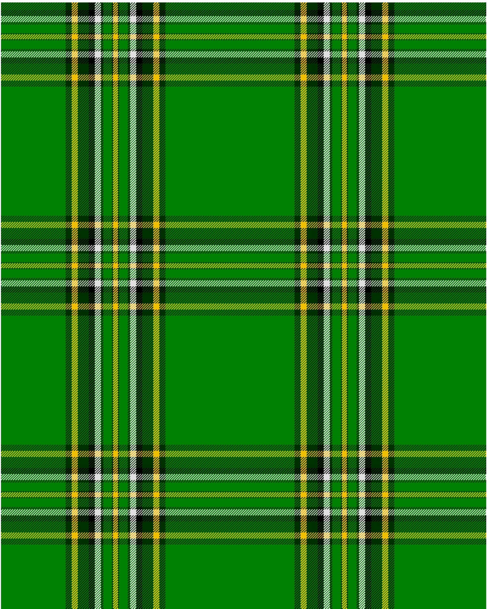

Irish National

This was sourced from <no value>.  It is a 10 stripes tartan.

Original link http://www.weddslist.com/cgi-bin/tartans/pg.pl?source=sts

## Thread count
G/106 DG10 Y10 DG18 K10 LN10 DG4 G14 DG2 Y/4

## Palette
DG#003000 G#008000 K#000000 LN#E0E0E0 Y#F0C000

# Sample pattern

ID: /variants/g/106/dg10/y10/dg18/k10/ln10/dg4/g14/dg2/y/4-dg003000-g008000-k000000-lne0e0e0-yf0c000