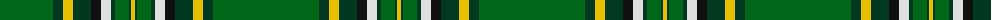

The parent of this is [Irish National](/tartans/g/106/dg10/y10/dg18/ka10/ln10/dg4/g14/dg2/y/4/)

This was sourced from register-of-tartans.  It is a [10 stripes tartan](/stripes/stripes10/).

Original link https://www.tartanregister.gov.uk/tartanDetails.aspx?ref=1855

## Thread count
G/106 DG10 Y10 DG18 Ka10 LN10 DG4 G14 DG2 Y/4

## Palette
Each colour and its ΔE from the base-6 reference it is a variant of.

| Colour | Shade | Base | ΔE (OKLab) |
|---|---|---|---|
| DG |  `#003820` | G  | 0.16 |
| G |  `#006818` | G  | 0.02 |
| K |  `#1C1C1C` | B  | 0.20 |
| Ka |  `#101010` | K  | 0.17 |
| LN |  `#E0E0E0` | W  | 0.06 |
| N |  `#C0C0C0` | W  | 0.16 |
| Y |  `#E8C000` | Y  | 0.00 |

ID: /variants/g/106/dg10/y10/dg18/ka10/ln10/dg4/g14/dg2/y/4-dg003820-g006818-k1c1c1c-ka101010-lne0e0e0-nc0c0c0-ye8c000/
