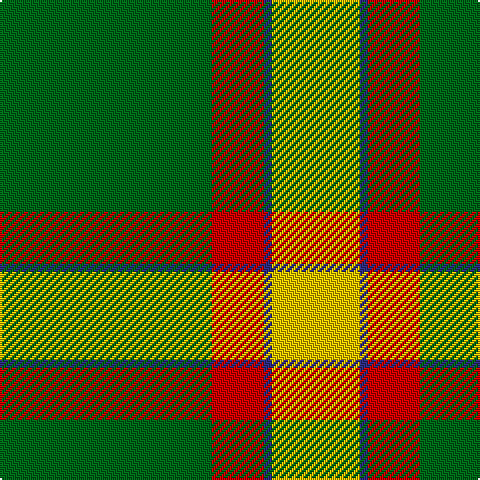

The parent of this is [Englehart Commemorative Tartan Tartan Number: 849. Earliest known date: 1958 Englehart semi-centennial. See products available Copyright © Blair Urquhart, Comrie, 2015](/tartans/g/106/r26/db4/y/44/)

This was sourced from house-of-tartan.  It is a [4 stripes tartan](/stripes/stripes4/).

Original link http://www.house-of-tartan.scotland.net/house/TartanViewjs.asp?colr=Def&tnam=849

## Thread count
G/106 R26 DB4 Y/44

## Palette
Each colour and its ΔE from the base-6 reference it is a variant of.

| Colour | Shade | Base | ΔE (OKLab) |
|---|---|---|---|
| DB |  `#2C2C80` | B  | 0.05 |
| G |  `#006818` | G  | 0.02 |
| R |  `#C80000` | R  | 0.00 |
| Y |  `#E8C000` | Y  | 0.00 |

# Sample pattern

ID: /variants/g/106/r26/db4/y/44-db2c2c80-g006818-rc80000-ye8c000/
