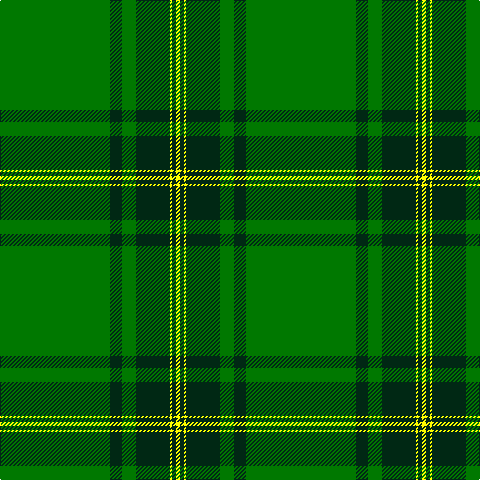

The parent of this is [MacBeorn](/tartans/g/110/dg12/g14/dg34/y2/dg4/y/4/)

This was sourced from register-of-tartans.  It is a [7 stripes tartan](/stripes/stripes7/).

Original link https://www.tartanregister.gov.uk/tartanDetails.aspx?ref=11524

## Thread count
G/110 DG12 G14 DG34 Y2 DG4 Y/4

## Palette
Each colour and its ΔE from the base-6 reference it is a variant of.

| Colour | Shade | Base | ΔE (OKLab) |
|---|---|---|---|
| DG |  `#002814` | B  | 0.21 |
| G |  `#007800` | G  | 0.06 |
| Y |  `#FFFF00` | Y  | 0.16 |

# Sample pattern

ID: /variants/g/110/dg12/g14/dg34/y2/dg4/y/4-dg002814-g007800-yffff00/
