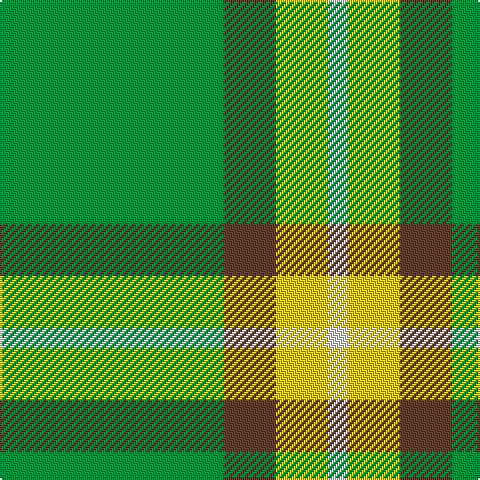

The parent of this is [Colonial Marine (Aliens Legacy)](/tartans/g/112/t26/y26/w/10/)

This was sourced from register-of-tartans.  It is a [4 stripes tartan](/stripes/stripes4/).

Original link https://www.tartanregister.gov.uk/tartanDetails.aspx?ref=10487

## Thread count
G/112 T26 Y26 W/10

## Palette
Each colour and its ΔE from the base-6 reference it is a variant of.

| Colour | Shade | Base | ΔE (OKLab) |
|---|---|---|---|
| G |  `#008B45` | G  | 0.12 |
| T |  `#5C4033` | B  | 0.15 |
| W |  `#E6E6FA` | W  | 0.05 |
| Y |  `#FFC125` | Y  | 0.04 |

# Sample pattern

ID: /variants/g/112/t26/y26/w/10-g008b45-t5c4033-we6e6fa-yffc125/
