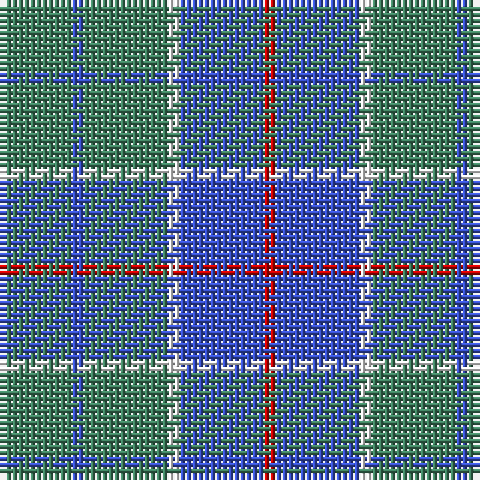

The parent of this is [Norris (1957) (Name)](/tartans/g/12/b2/g14/w2/b14/r/2/)

This was sourced from tartans-authority.  It is a [6 stripes tartan](/stripes/stripes6/).

Original link http://www.tartansauthority.com/tartan-ferret/display/5943/

## Thread count
G/12 B2 G14 W2 B14 R/2

## Palette
Each colour and its ΔE from the base-6 reference it is a variant of.

| Colour | Shade | Base | ΔE (OKLab) |
|---|---|---|---|
| B |  `#3850C8` | B  | 0.12 |
| G |  `#408060` | G  | 0.13 |
| R |  `#C80000` | R  | 0.00 |
| W |  `#FCFCFC` | W  | 0.03 |

# Sample pattern

ID: /variants/g/12/b2/g14/w2/b14/r/2-b3850c8-g408060-rc80000-wfcfcfc/
