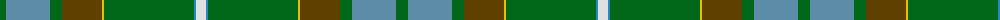

The parent of this is [Elbrick Hunting (Personal)](/tartans/g/12/b44/g12/t40/y2/g90/ba2/ln/10/)

This was sourced from tartans-authority.  It is a [8 stripes tartan](/stripes/stripes8/).

Original link http://www.tartansauthority.com/tartan-ferret/display/7362/

## Thread count
G/12 B44 G12 T40 Y2 G90 Ba2 LN/10

## Palette
Each colour and its ΔE from the base-6 reference it is a variant of.

| Colour | Shade | Base | ΔE (OKLab) |
|---|---|---|---|
| B |  `#5C8CA8` | B  | 0.23 |
| Ba |  `#2888C4` | B  | 0.21 |
| G |  `#006818` | G  | 0.02 |
| LN |  `#E0E0E0` | W  | 0.06 |
| T |  `#604000` | G  | 0.14 |
| Y |  `#E8C000` | Y  | 0.00 |

# Sample pattern

ID: /variants/g/12/b44/g12/t40/y2/g90/ba2/ln/10-b5c8ca8-ba2888c4-g006818-lne0e0e0-t604000-ye8c000/
