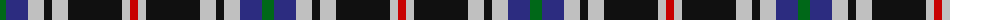

The parent of this is [Kervegant, Suzanne (Personal)](/tartans/g/12/db22/n16/k8/n16/k54/n8/r/8/)

This was sourced from tartans-authority.  It is a [8 stripes tartan](/stripes/stripes8/).

Original link http://www.tartansauthority.com/tartan-ferret/display/11269/

## Thread count
G/12 DB22 N16 K8 N16 K54 N8 R/8

## Palette
Each colour and its ΔE from the base-6 reference it is a variant of.

| Colour | Shade | Base | ΔE (OKLab) |
|---|---|---|---|
| DB |  `#2C2C80` | B  | 0.05 |
| G |  `#006818` | G  | 0.02 |
| K |  `#101010` | K  | 0.17 |
| N |  `#C0C0C0` | W  | 0.16 |
| R |  `#C80000` | R  | 0.00 |

# Sample pattern

ID: /variants/g/12/db22/n16/k8/n16/k54/n8/r/8-db2c2c80-g006818-k101010-nc0c0c0-rc80000/
