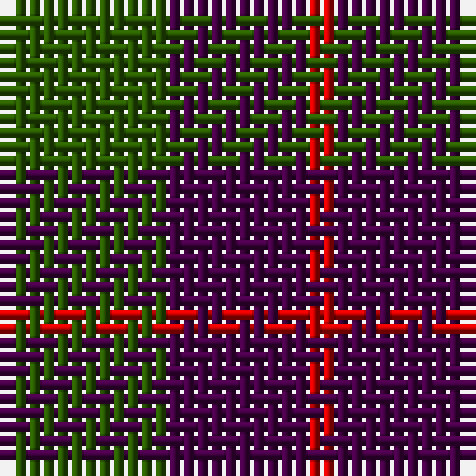

The parent of this is [Wilson's No.084](/tartans/g/12/dp10/r/2/)

This was sourced from register-of-tartans.  It is a [3 stripes tartan](/stripes/stripes3/).

Original link https://www.tartanregister.gov.uk/tartanDetails.aspx?ref=4670

## Thread count
G/12 DP10 R/2

## Palette
Each colour and its ΔE from the base-6 reference it is a variant of.

| Colour | Shade | Base | ΔE (OKLab) |
|---|---|---|---|
| DG |  `#003820` | G  | 0.16 |
| DP |  `#440044` | B  | 0.17 |
| G |  `#285800` | G  | 0.04 |
| P |  `#780078` | B  | 0.16 |
| R |  `#C80000` | R  | 0.00 |
| Ra |  `#C80000` | R  | 0.00 |

# Sample pattern

ID: /variants/g/12/dp10/r/2-dg003820-dp440044-g285800-p780078-rc80000-rac80000/
