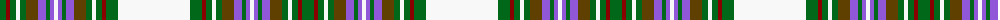

The parent of this is [Strathyre Dress (Dance) #2](/tartans/g/12/dr4/g6/w4/g6/t12/p8/g4/p4/w4/p4/g4/p8/t12/g6/w4/g6/dr4/g12/w/72/)

This was sourced from register-of-tartans.  It is a [20 stripes tartan](/stripes/stripes20/).

Original link https://www.tartanregister.gov.uk/tartanDetails.aspx?ref=5387

## Thread count
G/12 DR4 G6 W4 G6 T12 P8 G4 P4 W4 P4 G4 P8 T12 G6 W4 G6 DR4 G12 W/72

## Palette
Each colour and its ΔE from the base-6 reference it is a variant of.

| Colour | Shade | Base | ΔE (OKLab) |
|---|---|---|---|
| DR |  `#880000` | R  | 0.14 |
| G |  `#006818` | G  | 0.02 |
| N |  `#C0C0C0` | W  | 0.16 |
| P |  `#9058D8` | B  | 0.22 |
| T |  `#604000` | G  | 0.14 |
| W |  `#F8F8F8` | W  | 0.01 |

ID: /variants/g/12/dr4/g6/w4/g6/t12/p8/g4/p4/w4/p4/g4/p8/t12/g6/w4/g6/dr4/g12/w/72-dr880000-g006818-nc0c0c0-p9058d8-t604000-wf8f8f8/
