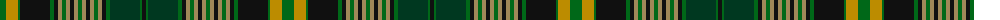

The parent of this is [Int. College of Dentists (Canada)](/tartans/g/12/dy12/g2/k30/g4/k4/lt4/g4/lt4/k4/lt4/g4/lt4/k4/lt4/g4/lt4/k4/g4/dg30/g2/k/4/)

This was sourced from tartans-authority.  It is a [22 stripes tartan](/stripes/stripes22/).

Original link http://www.tartansauthority.com/tartan-ferret/display/10482/

## Thread count
G/12 DY12 G2 K30 G4 K4 LT4 G4 LT4 K4 LT4 G4 LT4 K4 LT4 G4 LT4 K4 G4 DG30 G2 K/4

## Palette
Each colour and its ΔE from the base-6 reference it is a variant of.

| Colour | Shade | Base | ΔE (OKLab) |
|---|---|---|---|
| DG |  `#003820` | G  | 0.16 |
| DY |  `#BC8C00` | Y  | 0.16 |
| G |  `#006818` | G  | 0.02 |
| K |  `#101010` | K  | 0.17 |
| LT |  `#A08858` | Y  | 0.21 |

ID: /variants/g/12/dy12/g2/k30/g4/k4/lt4/g4/lt4/k4/lt4/g4/lt4/k4/lt4/g4/lt4/k4/g4/dg30/g2/k/4-dg003820-dybc8c00-g006818-k101010-lta08858/
