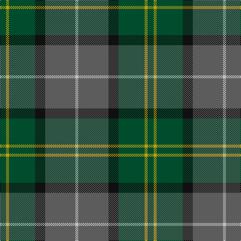

The parent of this is [Montrose (1983)](/tartans/g/12/dy6/g52/k20/na60/n/6/)

This was sourced from register-of-tartans.  It is a [6 stripes tartan](/stripes/stripes6/).

Original link https://www.tartanregister.gov.uk/tartanDetails.aspx?ref=2997

## Thread count
G/12 DY6 G52 K20 Na60 N/6

## Palette
Each colour and its ΔE from the base-6 reference it is a variant of.

| Colour | Shade | Base | ΔE (OKLab) |
|---|---|---|---|
| DY |  `#BCA010` | Y  | 0.11 |
| G |  `#004C2C` | G  | 0.10 |
| K |  `#101010` | K  | 0.17 |
| N |  `#C0C0C0` | W  | 0.16 |
| Na |  `#5C5C5C` | B  | 0.14 |

# Sample pattern

ID: /variants/g/12/dy6/g52/k20/na60/n/6-dybca010-g004c2c-k101010-nc0c0c0-na5c5c5c/
