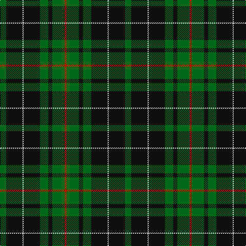

The parent of this is [MacAulay Htg (Clan)](/tartans/g/12/k32/w2/k32/g16/k8/g24/r/4/)

This was sourced from tartans-authority.  It is a [8 stripes tartan](/stripes/stripes8/).

Original link http://www.tartansauthority.com/tartan-ferret/display/827/

## Thread count
G/12 K32 W2 K32 G16 K8 G24 R/4

## Palette
Each colour and its ΔE from the base-6 reference it is a variant of.

| Colour | Shade | Base | ΔE (OKLab) |
|---|---|---|---|
| G |  `#006818` | G  | 0.02 |
| K |  `#101010` | K  | 0.17 |
| R |  `#C80000` | R  | 0.00 |
| W |  `#FCFCFC` | W  | 0.03 |

# Sample pattern

ID: /variants/g/12/k32/w2/k32/g16/k8/g24/r/4-g006818-k101010-rc80000-wfcfcfc/
