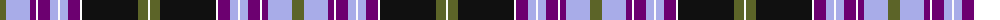

The parent of this is [Willox (Name)](/tartans/g/12/lp24/p6/w2/p12/lp8/w2/lp8/p12/w2/k56/g10/w/2/)

This was sourced from tartans-authority.  It is a [13 stripes tartan](/stripes/stripes13/).

Original link http://www.tartansauthority.com/tartan-ferret/display/4233/

## Thread count
G/12 LP24 P6 W2 P12 LP8 W2 LP8 P12 W2 K56 G10 W/2

## Palette
Each colour and its ΔE from the base-6 reference it is a variant of.

| Colour | Shade | Base | ΔE (OKLab) |
|---|---|---|---|
| G |  `#5C6428` | G  | 0.09 |
| K |  `#101010` | K  | 0.17 |
| LP |  `#A8ACE8` | W  | 0.22 |
| P |  `#6C0070` | B  | 0.15 |
| W |  `#FCFCFC` | W  | 0.03 |

ID: /variants/g/12/lp24/p6/w2/p12/lp8/w2/lp8/p12/w2/k56/g10/w/2-g5c6428-k101010-lpa8ace8-p6c0070-wfcfcfc/
