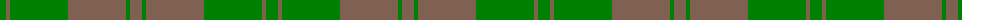
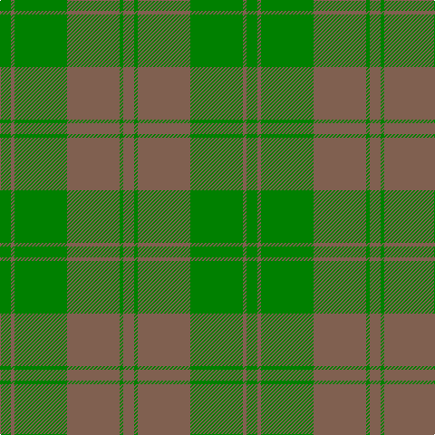

The parent of this is [Harmony, 11](/tartans/g/12/lt4/g58/lt58/g4/lt/12/)

This was sourced from weddslist.  It is a [6 stripes tartan](/stripes/stripes6/).

Original link http://www.weddslist.com/cgi-bin/tartans/pg.pl?source=sts

## Thread count
G/12 LT4 G58 LT58 G4 LT/12

## Palette
Each colour and its ΔE from the base-6 reference it is a variant of.

| Colour | Shade | Base | ΔE (OKLab) |
|---|---|---|---|
| G |  `#008000` | G  | 0.09 |
| LT |  `#806050` | R  | 0.17 |

# Sample pattern

ID: /variants/g/12/lt4/g58/lt58/g4/lt/12-g008000-lt806050/
