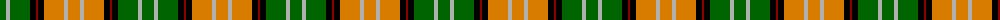

The parent of this is [Eire (District?)](/tartans/g/12/n4/g20/k6/dr2/k6/o20/n4/o/12/)

This was sourced from tartans-authority.  It is a [9 stripes tartan](/stripes/stripes9/).

Original link http://www.tartansauthority.com/tartan-ferret/display/4801/

## Thread count
G/12 N4 G20 K6 DR2 K6 O20 N4 O/12

## Palette
Each colour and its ΔE from the base-6 reference it is a variant of.

| Colour | Shade | Base | ΔE (OKLab) |
|---|---|---|---|
| DR |  `#8C0000` | R  | 0.13 |
| G |  `#006400` | G  | 0.00 |
| K |  `#000000` | K  | 0.00 |
| N |  `#B0B0B0` | Y  | 0.18 |
| O |  `#D87C00` | Y  | 0.17 |

ID: /variants/g/12/n4/g20/k6/dr2/k6/o20/n4/o/12-dr8c0000-g006400-k000000-nb0b0b0-od87c00/
