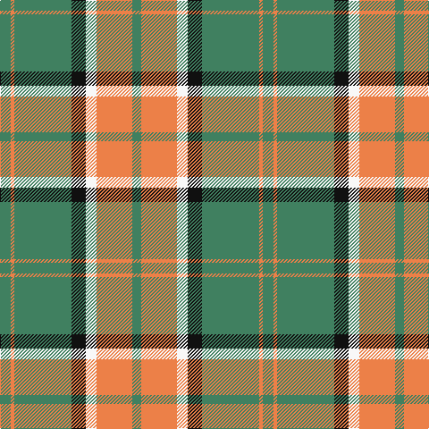

The parent of this is [Pollock (Name)](/tartans/g/12/o4/g64/k16/w12/o40/g/10/)

This was sourced from tartans-authority.  It is a [7 stripes tartan](/stripes/stripes7/).

Original link http://www.tartansauthority.com/tartan-ferret/display/867/

## Thread count
G/12 O4 G64 K16 W12 O40 G/10

## Palette
Each colour and its ΔE from the base-6 reference it is a variant of.

| Colour | Shade | Base | ΔE (OKLab) |
|---|---|---|---|
| G |  `#408060` | G  | 0.13 |
| K |  `#101010` | K  | 0.17 |
| O |  `#EC8048` | Y  | 0.17 |
| W |  `#F8F8F8` | W  | 0.01 |

# Sample pattern

ID: /variants/g/12/o4/g64/k16/w12/o40/g/10-g408060-k101010-oec8048-wf8f8f8/
