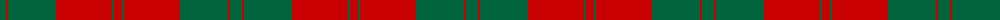

The parent of this is [Erskine (Clan)](/tartans/g/12/r2/g48/r56/g2/r/8/)

This was sourced from tartans-authority.  It is a [6 stripes tartan](/stripes/stripes6/).

Original link http://www.tartansauthority.com/tartan-ferret/display/891/

## Thread count
G/12 R2 G48 R56 G2 R/8

## Palette
Each colour and its ΔE from the base-6 reference it is a variant of.

| Colour | Shade | Base | ΔE (OKLab) |
|---|---|---|---|
| G |  `#00643C` | G  | 0.06 |
| R |  `#C80000` | R  | 0.00 |

# Sample pattern

ID: /variants/g/12/r2/g48/r56/g2/r/8-g00643c-rc80000/
