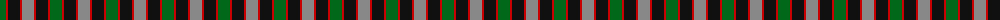
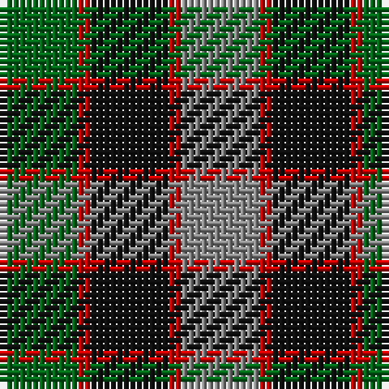

The parent of this is [Timespan (MacKay) Corporate Tartan Tartan Number: 1002. Earliest known date: 1989 Based on MacKay of Strathnaver for 'Timespan Heritage Centre' at Helmsdale See products available Copyright © Blair Urquhart, Comrie, 2015](/tartans/g/12/r2/k12/r2/n/12/)

This was sourced from house-of-tartan.  It is a [5 stripes tartan](/stripes/stripes5/).

Original link http://www.house-of-tartan.scotland.net/house/TartanViewjs.asp?colr=Def&tnam=1002

## Thread count
G/12 R2 K12 R2 N/12

## Palette
Each colour and its ΔE from the base-6 reference it is a variant of.

| Colour | Shade | Base | ΔE (OKLab) |
|---|---|---|---|
| G |  `#006818` | G  | 0.02 |
| K |  `#101010` | K  | 0.17 |
| N |  `#888888` | R  | 0.24 |
| R |  `#C80000` | R  | 0.00 |

# Sample pattern

ID: /variants/g/12/r2/k12/r2/n/12-g006818-k101010-n888888-rc80000/
