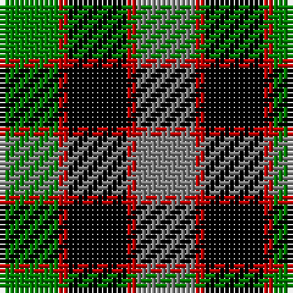

The parent of this is [Timespan, (MacKay)](/tartans/g/12/r2/k12/r2/n/12/)

This was sourced from weddslist.  It is a [5 stripes tartan](/stripes/stripes5/).

Original link http://www.weddslist.com/cgi-bin/tartans/pg.pl?source=sts

## Thread count
G/12 R2 K12 R2 N/12

## Palette
Each colour and its ΔE from the base-6 reference it is a variant of.

| Colour | Shade | Base | ΔE (OKLab) |
|---|---|---|---|
| G |  `#008000` | G  | 0.09 |
| K |  `#000000` | K  | 0.00 |
| N |  `#808080` | G  | 0.22 |
| R |  `#C00000` | R  | 0.02 |

# Sample pattern

ID: /variants/g/12/r2/k12/r2/n/12-g008000-k000000-n808080-rc00000/
