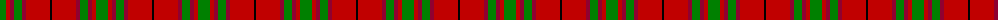

The parent of this is [MacNab 5](/tartans/g/12/r4/dr4/g8/dr4/r24/k/2/)

This was sourced from weddslist.  It is a [7 stripes tartan](/stripes/stripes7/).

Original link http://www.weddslist.com/cgi-bin/tartans/pg.pl?source=sts

## Thread count
G/12 R4 DR4 G8 DR4 R24 K/2

## Palette
Each colour and its ΔE from the base-6 reference it is a variant of.

| Colour | Shade | Base | ΔE (OKLab) |
|---|---|---|---|
| DR |  `#900030` | R  | 0.13 |
| G |  `#008000` | G  | 0.09 |
| K |  `#000000` | K  | 0.00 |
| R |  `#C00000` | R  | 0.02 |

# Sample pattern

ID: /variants/g/12/r4/dr4/g8/dr4/r24/k/2-dr900030-g008000-k000000-rc00000/
