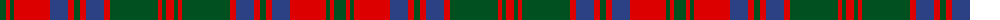

The parent of this is [Stuart/Stewart of Urrard](/tartans/g/12/r4/g4/r36/b18/r6/g6/r6/b18/r6/g48/r4/g4/r/8/)

This was sourced from register-of-tartans.  It is a [14 stripes tartan](/stripes/stripes14/).

Original link https://www.tartanregister.gov.uk/tartanDetails.aspx?ref=4021

## Thread count
G/12 R4 G4 R36 B18 R6 G6 R6 B18 R6 G48 R4 G4 R/8

## Palette
Each colour and its ΔE from the base-6 reference it is a variant of.

| Colour | Shade | Base | ΔE (OKLab) |
|---|---|---|---|
| B |  `#2C4084` | B  | 0.00 |
| G |  `#005020` | G  | 0.08 |
| R |  `#DC0000` | R  | 0.04 |

ID: /variants/g/12/r4/g4/r36/b18/r6/g6/r6/b18/r6/g48/r4/g4/r/8-b2c4084-g005020-rdc0000/
