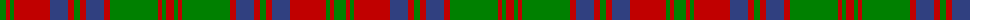

The parent of this is [Stewart of Urrard](/tartans/g/12/r4/g4/r36/b18/r6/g6/r6/b18/r6/g48/r4/g4/r/8/)

This was sourced from weddslist.  It is a [14 stripes tartan](/stripes/stripes14/).

Original link http://www.weddslist.com/cgi-bin/tartans/pg.pl?source=sts

## Thread count
G/12 R4 G4 R36 B18 R6 G6 R6 B18 R6 G48 R4 G4 R/8

## Palette
Each colour and its ΔE from the base-6 reference it is a variant of.

| Colour | Shade | Base | ΔE (OKLab) |
|---|---|---|---|
| B |  `#304080` | B  | 0.01 |
| G |  `#008000` | G  | 0.09 |
| R |  `#C00000` | R  | 0.02 |

ID: /variants/g/12/r4/g4/r36/b18/r6/g6/r6/b18/r6/g48/r4/g4/r/8-b304080-g008000-rc00000/
