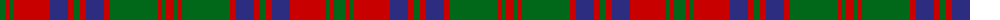

The parent of this is [Stewart of Urrard Clan Tartan Tartan Number: 898. Earliest known date: pre 1930 A kilt in this material was brought into the Scottish Tartans Museum in Comrie which could be dated to before 1930. It belonged to a member of the Stewart Society at that time. The threadcount and the name were documented by Mackinlay, who studied and collected tartans between 1930 and 1950. See products available Copyright © Blair Urquhart, Comrie, 2015](/tartans/g/12/r4/g4/r36/db18/r6/g6/r6/db18/r6/g48/r4/g4/r/8/)

This was sourced from house-of-tartan.  It is a [14 stripes tartan](/stripes/stripes14/).

Original link http://www.house-of-tartan.scotland.net/house/TartanViewjs.asp?colr=Def&tnam=898

## Thread count
G/12 R4 G4 R36 DB18 R6 G6 R6 DB18 R6 G48 R4 G4 R/8

## Palette
Each colour and its ΔE from the base-6 reference it is a variant of.

| Colour | Shade | Base | ΔE (OKLab) |
|---|---|---|---|
| DB |  `#2C2C80` | B  | 0.05 |
| G |  `#006818` | G  | 0.02 |
| R |  `#C80000` | R  | 0.00 |

ID: /variants/g/12/r4/g4/r36/db18/r6/g6/r6/db18/r6/g48/r4/g4/r/8-db2c2c80-g006818-rc80000/
