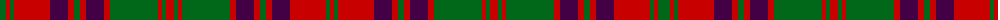

The parent of this is [Stewart of Killiecrankie](/tartans/g/12/r4/g4/r36/dp18/r6/g6/r6/dp18/r6/g48/r4/g4/r8/g4/r4/g48/r6/dp18/r6/g6/r6/dp18/r36/g4/r/4/)

This was sourced from register-of-tartans.  It is a [26 stripes tartan](/stripes/stripes26/).

Original link https://www.tartanregister.gov.uk/tartanDetails.aspx?ref=4984

## Thread count
G/12 R4 G4 R36 DP18 R6 G6 R6 DP18 R6 G48 R4 G4 R8 G4 R4 G48 R6 DP18 R6 G6 R6 DP18 R36 G4 R/4

## Palette
Each colour and its ΔE from the base-6 reference it is a variant of.

| Colour | Shade | Base | ΔE (OKLab) |
|---|---|---|---|
| DG |  `#003820` | G  | 0.16 |
| DP |  `#440044` | B  | 0.17 |
| G |  `#006818` | G  | 0.02 |
| R |  `#C80000` | R  | 0.00 |

ID: /variants/g/12/r4/g4/r36/dp18/r6/g6/r6/dp18/r6/g48/r4/g4/r8/g4/r4/g48/r6/dp18/r6/g6/r6/dp18/r36/g4/r/4-dg003820-dp440044-g006818-rc80000/
