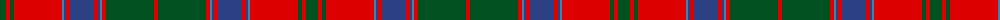

The parent of this is [Unidentified Coat](/tartans/g/12/r4/g4/r48/b2/ba2/r4/ba24/r4/ba2/b2/r4/g48/r/4/)

This was sourced from register-of-tartans.  It is a [14 stripes tartan](/stripes/stripes14/).

Original link https://www.tartanregister.gov.uk/tartanDetails.aspx?ref=4288

## Thread count
G/12 R4 G4 R48 B2 Ba2 R4 Ba24 R4 Ba2 B2 R4 G48 R/4

## Palette
Each colour and its ΔE from the base-6 reference it is a variant of.

| Colour | Shade | Base | ΔE (OKLab) |
|---|---|---|---|
| B |  `#3C82AF` | B  | 0.20 |
| Ba |  `#2C4084` | B  | 0.00 |
| G |  `#005020` | G  | 0.08 |
| R |  `#DC0000` | R  | 0.04 |

ID: /variants/g/12/r4/g4/r48/b2/ba2/r4/ba24/r4/ba2/b2/r4/g48/r/4-b3c82af-ba2c4084-g005020-rdc0000/
