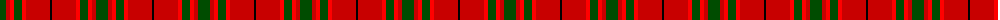

The parent of this is [MacNab VS](/tartans/g/12/r4/ra4/g8/ra4/r24/k/2/)

This was sourced from weddslist.  It is a [7 stripes tartan](/stripes/stripes7/).

Original link http://www.weddslist.com/cgi-bin/tartans/pg.pl?source=rb

## Thread count
G/12 R4 Ra4 G8 Ra4 R24 K/2

## Palette
Each colour and its ΔE from the base-6 reference it is a variant of.

| Colour | Shade | Base | ΔE (OKLab) |
|---|---|---|---|
| G |  `#004C00` | G  | 0.08 |
| K |  `#000000` | K  | 0.00 |
| R |  `#C80000` | R  | 0.00 |
| Ra |  `#FF0000` | R  | 0.11 |

# Sample pattern

ID: /variants/g/12/r4/ra4/g8/ra4/r24/k/2-g004c00-k000000-rc80000-raff0000/
