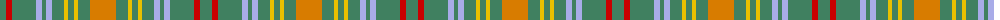

The parent of this is [O'Brien (Name)](/tartans/g/12/r6/g24/lp6/g4/lp6/g12/y4/g6/y4/g12/o/26/)

This was sourced from tartans-authority.  It is a [12 stripes tartan](/stripes/stripes12/).

Original link http://www.tartansauthority.com/tartan-ferret/display/2225/

## Thread count
G/12 R6 G24 LP6 G4 LP6 G12 Y4 G6 Y4 G12 O/26

## Palette
Each colour and its ΔE from the base-6 reference it is a variant of.

| Colour | Shade | Base | ΔE (OKLab) |
|---|---|---|---|
| G |  `#408060` | G  | 0.13 |
| LP |  `#A8ACE8` | W  | 0.22 |
| O |  `#D87C00` | Y  | 0.17 |
| R |  `#C80000` | R  | 0.00 |
| Y |  `#E8C000` | Y  | 0.00 |

ID: /variants/g/12/r6/g24/lp6/g4/lp6/g12/y4/g6/y4/g12/o/26-g408060-lpa8ace8-od87c00-rc80000-ye8c000/
