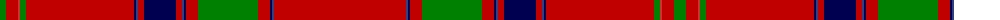

The parent of this is [Unidentified 8](/tartans/g/12/ra12/r2/g6/ra108/db2/b2/ra6/db32/ra6/b2/db2/ra12/g60/ra12/db2/b2/ra/132/)

This was sourced from weddslist.  It is a [18 stripes tartan](/stripes/stripes18/).

Original link http://www.weddslist.com/cgi-bin/tartans/pg.pl?source=sts

## Thread count
G/12 Ra12 R2 G6 Ra108 DB2 B2 Ra6 DB32 Ra6 B2 DB2 Ra12 G60 Ra12 DB2 B2 Ra/132

## Palette
Each colour and its ΔE from the base-6 reference it is a variant of.

| Colour | Shade | Base | ΔE (OKLab) |
|---|---|---|---|
| B |  `#304080` | B  | 0.01 |
| DB |  `#000050` | B  | 0.20 |
| G |  `#008000` | G  | 0.09 |
| R |  `#D03030` | R  | 0.05 |
| Ra |  `#C00000` | R  | 0.02 |

ID: /variants/g/12/ra12/r2/g6/ra108/db2/b2/ra6/db32/ra6/b2/db2/ra12/g60/ra12/db2/b2/ra/132-b304080-db000050-g008000-rd03030-rac00000/
