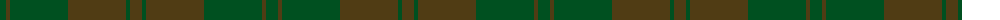

The parent of this is [Harmony 11 #2](/tartans/g/12/t4/g58/t58/g4/t/12/)

This was sourced from register-of-tartans.  It is a [6 stripes tartan](/stripes/stripes6/).

Original link https://www.tartanregister.gov.uk/tartanDetails.aspx?ref=1604

## Thread count
G/12 T4 G58 T58 G4 T/12

## Palette
Each colour and its ΔE from the base-6 reference it is a variant of.

| Colour | Shade | Base | ΔE (OKLab) |
|---|---|---|---|
| G |  `#005020` | G  | 0.08 |
| T |  `#503C14` | G  | 0.15 |

# Sample pattern

ID: /variants/g/12/t4/g58/t58/g4/t/12-g005020-t503c14/
