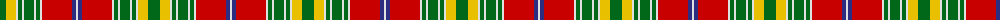

The parent of this is [Dunblane District Tartan Tartan Number: 1022. Earliest known date: 1729 Peregrine, 2nd Viscount Dunblane in a portrait hanging in Hornby Castle, Yorkshire. See products available Copyright © Blair Urquhart, Comrie, 2015](/tartans/g/12/y10/ln2/g4/ln2/g10/ln2/g4/ln2/r30/db4/ln/2/)

This was sourced from house-of-tartan.  It is a [12 stripes tartan](/stripes/stripes12/).

Original link http://www.house-of-tartan.scotland.net/house/TartanViewjs.asp?colr=Def&tnam=1022

## Thread count
G/12 Y10 LN2 G4 LN2 G10 LN2 G4 LN2 R30 DB4 LN/2

## Palette
Each colour and its ΔE from the base-6 reference it is a variant of.

| Colour | Shade | Base | ΔE (OKLab) |
|---|---|---|---|
| DB |  `#2C2C80` | B  | 0.05 |
| G |  `#006818` | G  | 0.02 |
| LN |  `#E0E0E0` | W  | 0.06 |
| R |  `#C80000` | R  | 0.00 |
| Y |  `#E8C000` | Y  | 0.00 |

ID: /variants/g/12/y10/ln2/g4/ln2/g10/ln2/g4/ln2/r30/db4/ln/2-db2c2c80-g006818-lne0e0e0-rc80000-ye8c000/
