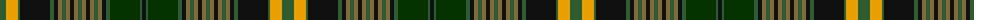

The parent of this is [International College of Dentists (Canadian Section)](/tartans/g/12/y12/g2/k30/g4/k4/lt4/g4/lt4/k4/lt4/g4/lt4/k4/lt4/g4/lt4/k4/g4/dg30/g2/k/4/)

This was sourced from register-of-tartans.  It is a [22 stripes tartan](/stripes/stripes22/).

Original link https://www.tartanregister.gov.uk/tartanDetails.aspx?ref=10482

## Thread count
G/12 Y12 G2 K30 G4 K4 LT4 G4 LT4 K4 LT4 G4 LT4 K4 LT4 G4 LT4 K4 G4 DG30 G2 K/4

## Palette
Each colour and its ΔE from the base-6 reference it is a variant of.

| Colour | Shade | Base | ΔE (OKLab) |
|---|---|---|---|
| DG |  `#043300` | G  | 0.17 |
| G |  `#2D5C33` | G  | 0.06 |
| K |  `#101010` | K  | 0.17 |
| LT |  `#826B3A` | G  | 0.16 |
| Y |  `#E99E01` | Y  | 0.08 |

ID: /variants/g/12/y12/g2/k30/g4/k4/lt4/g4/lt4/k4/lt4/g4/lt4/k4/lt4/g4/lt4/k4/g4/dg30/g2/k/4-dg043300-g2d5c33-k101010-lt826b3a-ye99e01/
