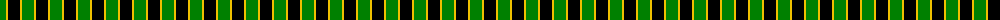
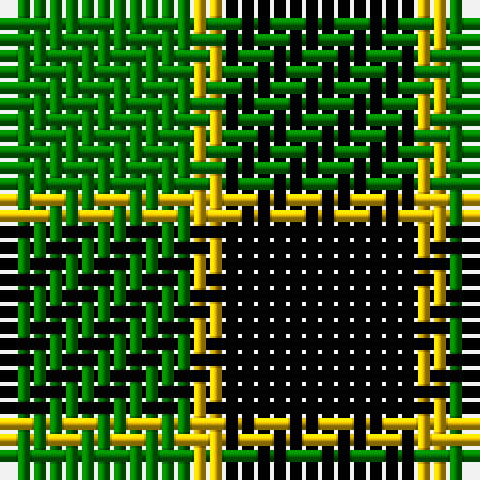

The parent of this is [Wilson's, No 197](/tartans/g/12/y2/k/12/)

This was sourced from weddslist.  It is a [3 stripes tartan](/stripes/stripes3/).

Original link http://www.weddslist.com/cgi-bin/tartans/pg.pl?source=sts

## Thread count
G/12 Y2 K/12

## Palette
Each colour and its ΔE from the base-6 reference it is a variant of.

| Colour | Shade | Base | ΔE (OKLab) |
|---|---|---|---|
| G |  `#008000` | G  | 0.09 |
| K |  `#000000` | K  | 0.00 |
| Y |  `#F0C000` | Y  | 0.01 |

# Sample pattern

ID: /variants/g/12/y2/k/12-g008000-k000000-yf0c000/
