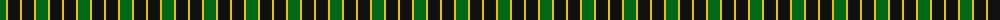
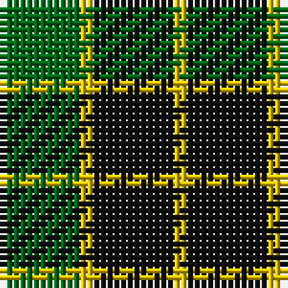

The parent of this is [Wilson's No.197](/tartans/g/12/y2/k12/y/2/)

This was sourced from register-of-tartans.  It is a [4 stripes tartan](/stripes/stripes4/).

Original link https://www.tartanregister.gov.uk/tartanDetails.aspx?ref=4729

## Thread count
G/12 Y2 K12 Y/2

## Palette
Each colour and its ΔE from the base-6 reference it is a variant of.

| Colour | Shade | Base | ΔE (OKLab) |
|---|---|---|---|
| DG |  `#003820` | G  | 0.16 |
| G |  `#006818` | G  | 0.02 |
| K |  `#101010` | K  | 0.17 |
| Y |  `#E8C000` | Y  | 0.00 |
| Ya |  `#D8B000` | Y  | 0.05 |

# Sample pattern

ID: /variants/g/12/y2/k12/y/2-dg003820-g006818-k101010-ye8c000-yad8b000/
