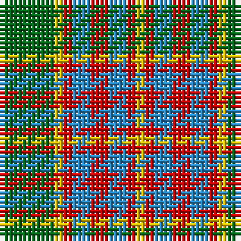

The parent of this is [Wilson's No.179](/tartans/g/12/y2/r2/b4/r4/b4/r2/y/2/)

This was sourced from register-of-tartans.  It is a [8 stripes tartan](/stripes/stripes8/).

Original link https://www.tartanregister.gov.uk/tartanDetails.aspx?ref=4716

## Thread count
G/12 Y2 R2 B4 R4 B4 R2 Y/2

## Palette
Each colour and its ΔE from the base-6 reference it is a variant of.

| Colour | Shade | Base | ΔE (OKLab) |
|---|---|---|---|
| B |  `#2888C4` | B  | 0.21 |
| DG |  `#003820` | G  | 0.16 |
| G |  `#006818` | G  | 0.02 |
| R |  `#C80000` | R  | 0.00 |
| Y |  `#E8C000` | Y  | 0.00 |

# Sample pattern

ID: /variants/g/12/y2/r2/b4/r4/b4/r2/y/2-b2888c4-dg003820-g006818-rc80000-ye8c000/
