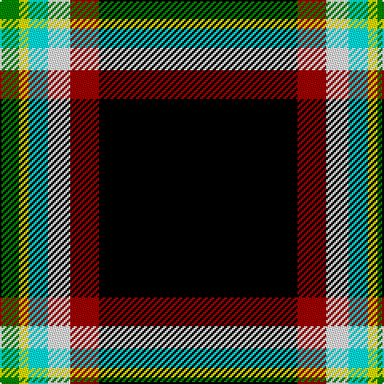

The parent of this is [Tainsh (2016)](/tartans/g/12/y6/lb12/w14/dr18/k/124/)

This was sourced from register-of-tartans.  It is a [6 stripes tartan](/stripes/stripes6/).

Original link https://www.tartanregister.gov.uk/tartanDetails.aspx?ref=11582

## Thread count
G/12 Y6 LB12 W14 DR18 K/124

## Palette
Each colour and its ΔE from the base-6 reference it is a variant of.

| Colour | Shade | Base | ΔE (OKLab) |
|---|---|---|---|
| DR |  `#A00000` | R  | 0.09 |
| G |  `#008B00` | G  | 0.12 |
| K |  `#000000` | K  | 0.00 |
| LB |  `#00FCFC` | W  | 0.17 |
| W |  `#FCFCFC` | W  | 0.03 |
| Y |  `#FFFF00` | Y  | 0.16 |

# Sample pattern

ID: /variants/g/12/y6/lb12/w14/dr18/k/124-dra00000-g008b00-k000000-lb00fcfc-wfcfcfc-yffff00/
