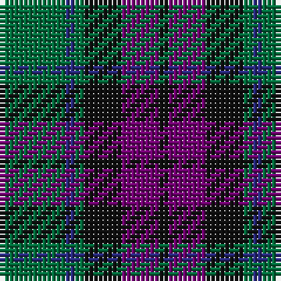

The parent of this is [MacArthur of Milton (Clan)](/tartans/g/14/db2/g2/k8/p8/k/2/)

This was sourced from tartans-authority.  It is a [6 stripes tartan](/stripes/stripes6/).

Original link http://www.tartansauthority.com/tartan-ferret/display/700/

## Thread count
G/14 DB2 G2 K8 P8 K/2

## Palette
Each colour and its ΔE from the base-6 reference it is a variant of.

| Colour | Shade | Base | ΔE (OKLab) |
|---|---|---|---|
| DB |  `#28287C` | B  | 0.06 |
| G |  `#006C3C` | G  | 0.05 |
| K |  `#101010` | K  | 0.17 |
| P |  `#700070` | B  | 0.16 |

# Sample pattern

ID: /variants/g/14/db2/g2/k8/p8/k/2-db28287c-g006c3c-k101010-p700070/
