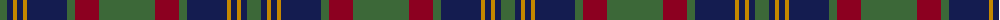

The parent of this is [Cork Irish County Tartan Tartan Number: 2253. Earliest known date: 1996 One of a series of Irish District tartans designed by Polly Wittering of the House of Edgar, with colours reminiscent of the Country with soft warm colours dominating. See products available Copyright © Blair Urquhart, Comrie, 2015](/tartans/g/14/db6/dy4/db6/dy4/db40/g8/dr24/g/56/)

This was sourced from house-of-tartan.  It is a [9 stripes tartan](/stripes/stripes9/).

Original link http://www.house-of-tartan.scotland.net/house/TartanViewjs.asp?colr=Def&tnam=2253

## Thread count
G/14 DB6 DY4 DB6 DY4 DB40 G8 DR24 G/56

## Palette
Each colour and its ΔE from the base-6 reference it is a variant of.

| Colour | Shade | Base | ΔE (OKLab) |
|---|---|---|---|
| DB |  `#141C50` | B  | 0.14 |
| DR |  `#8C0020` | R  | 0.13 |
| DY |  `#C48800` | Y  | 0.16 |
| G |  `#3C6838` | G  | 0.07 |

ID: /variants/g/14/db6/dy4/db6/dy4/db40/g8/dr24/g/56-db141c50-dr8c0020-dyc48800-g3c6838/
