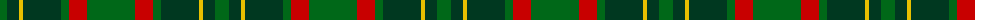

The parent of this is [Doyle Irish Family Tartan Tartan Number: 2511. Earliest known date: 1999 Clan Doyle runs it Clan Register from PO Box 173, Dromana, Victoria, 3936, Australia. The tartan is restricted to registered clansmen. See products available Copyright © Blair Urquhart, Comrie, 2015](/tartans/g/14/dg12/y4/dg38/g8/r18/g/48/)

This was sourced from house-of-tartan.  It is a [7 stripes tartan](/stripes/stripes7/).

Original link http://www.house-of-tartan.scotland.net/house/TartanViewjs.asp?colr=Def&tnam=2511

## Thread count
G/14 DG12 Y4 DG38 G8 R18 G/48

## Palette
Each colour and its ΔE from the base-6 reference it is a variant of.

| Colour | Shade | Base | ΔE (OKLab) |
|---|---|---|---|
| DG |  `#003820` | G  | 0.16 |
| G |  `#006818` | G  | 0.02 |
| R |  `#C80000` | R  | 0.00 |
| Y |  `#E8C000` | Y  | 0.00 |

# Sample pattern

ID: /variants/g/14/dg12/y4/dg38/g8/r18/g/48-dg003820-g006818-rc80000-ye8c000/
