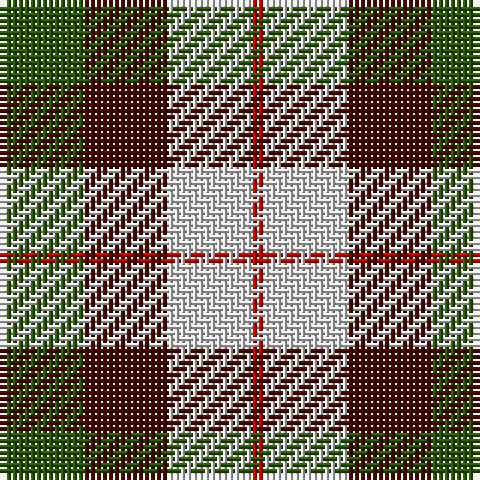

The parent of this is [MacKinnon Dress Hunting (Fashion)](/tartans/g/14/dr14/ln14/r/2/)

This was sourced from tartans-authority.  It is a [4 stripes tartan](/stripes/stripes4/).

Original link http://www.tartansauthority.com/tartan-ferret/display/921/

## Thread count
G/14 DR14 LN14 R/2

## Palette
Each colour and its ΔE from the base-6 reference it is a variant of.

| Colour | Shade | Base | ΔE (OKLab) |
|---|---|---|---|
| DR |  `#480800` | B  | 0.23 |
| G |  `#285800` | G  | 0.04 |
| LN |  `#E0E0E0` | W  | 0.06 |
| R |  `#C80000` | R  | 0.00 |

# Sample pattern

ID: /variants/g/14/dr14/ln14/r/2-dr480800-g285800-lne0e0e0-rc80000/
