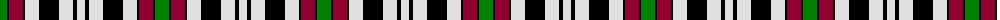

The parent of this is [Borthwick, dress](/tartans/g/14/k2/dr14/k2/ln14/k20/ln14/k4/ln/8/)

This was sourced from weddslist.  It is a [9 stripes tartan](/stripes/stripes9/).

Original link http://www.weddslist.com/cgi-bin/tartans/pg.pl?source=sts

## Thread count
G/14 K2 DR14 K2 LN14 K20 LN14 K4 LN/8

## Palette
Each colour and its ΔE from the base-6 reference it is a variant of.

| Colour | Shade | Base | ΔE (OKLab) |
|---|---|---|---|
| DR |  `#900030` | R  | 0.13 |
| G |  `#008000` | G  | 0.09 |
| K |  `#000000` | K  | 0.00 |
| LN |  `#E0E0E0` | W  | 0.06 |

ID: /variants/g/14/k2/dr14/k2/ln14/k20/ln14/k4/ln/8-dr900030-g008000-k000000-lne0e0e0/
