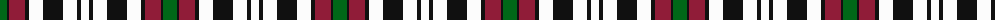

The parent of this is [Borthwick Dress (Clan)](/tartans/g/14/k2/dr16/k4/w14/k20/w14/k4/w/8/)

This was sourced from tartans-authority.  It is a [9 stripes tartan](/stripes/stripes9/).

Original link http://www.tartansauthority.com/tartan-ferret/display/820/

## Thread count
G/14 K2 DR16 K4 W14 K20 W14 K4 W/8

## Palette
Each colour and its ΔE from the base-6 reference it is a variant of.

| Colour | Shade | Base | ΔE (OKLab) |
|---|---|---|---|
| DR |  `#901C38` | R  | 0.12 |
| G |  `#006818` | G  | 0.02 |
| K |  `#101010` | K  | 0.17 |
| W |  `#FCFCFC` | W  | 0.03 |

ID: /variants/g/14/k2/dr16/k4/w14/k20/w14/k4/w/8-dr901c38-g006818-k101010-wfcfcfc/
