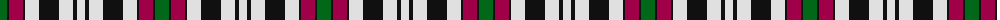

The parent of this is [Borthwick Dress Artifact Tartan Tartan Number: 820. Earliest known date: pre 2003 No details available. See products available Copyright © Blair Urquhart, Comrie, 2015](/tartans/g/14/k2/r14/k2/ln14/k20/ln14/k4/ln/8/)

This was sourced from house-of-tartan.  It is a [9 stripes tartan](/stripes/stripes9/).

Original link http://www.house-of-tartan.scotland.net/house/TartanViewjs.asp?colr=Def&tnam=820

## Thread count
G/14 K2 R14 K2 LN14 K20 LN14 K4 LN/8

## Palette
Each colour and its ΔE from the base-6 reference it is a variant of.

| Colour | Shade | Base | ΔE (OKLab) |
|---|---|---|---|
| G |  `#006818` | G  | 0.02 |
| K |  `#101010` | K  | 0.17 |
| LN |  `#E0E0E0` | W  | 0.06 |
| R |  `#A00048` | R  | 0.11 |

ID: /variants/g/14/k2/r14/k2/ln14/k20/ln14/k4/ln/8-g006818-k101010-lne0e0e0-ra00048/
