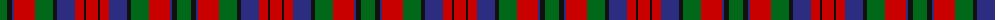

The parent of this is [Delanghe, Ruben (Personal)](/tartans/g/14/k5/db2/r21/g18/k4/db18/r9/k2/r/12/)

This was sourced from tartans-authority.  It is a [10 stripes tartan](/stripes/stripes10/).

Original link http://www.tartansauthority.com/tartan-ferret/display/10054/

## Thread count
G/14 K5 DB2 R21 G18 K4 DB18 R9 K2 R/12

## Palette
Each colour and its ΔE from the base-6 reference it is a variant of.

| Colour | Shade | Base | ΔE (OKLab) |
|---|---|---|---|
| DB |  `#2C2C80` | B  | 0.05 |
| G |  `#006818` | G  | 0.02 |
| K |  `#101010` | K  | 0.17 |
| R |  `#C80000` | R  | 0.00 |

ID: /variants/g/14/k5/db2/r21/g18/k4/db18/r9/k2/r/12-db2c2c80-g006818-k101010-rc80000/
