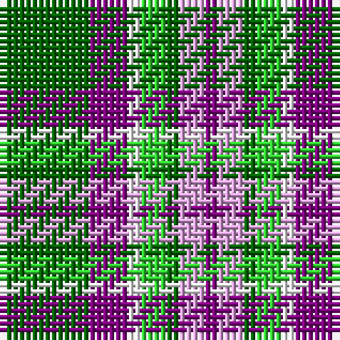

The parent of this is [Lindley-Highfield of Ballumbie Castle](/tartans/g/14/p6/w2/ga4/g2/lp4/p/2/)

This was sourced from register-of-tartans.  It is a [7 stripes tartan](/stripes/stripes7/).

Original link https://www.tartanregister.gov.uk/tartanDetails.aspx?ref=10002

## Thread count
G/14 P6 W2 Ga4 G2 LP4 P/2

## Palette
Each colour and its ΔE from the base-6 reference it is a variant of.

| Colour | Shade | Base | ΔE (OKLab) |
|---|---|---|---|
| G |  `#006400` | G  | 0.00 |
| Ga |  `#32CD32` | Y  | 0.19 |
| LP |  `#DDA0DD` | W  | 0.21 |
| P |  `#800080` | B  | 0.17 |
| W |  `#FFFFFF` | W  | 0.03 |

# Sample pattern

ID: /variants/g/14/p6/w2/ga4/g2/lp4/p/2-g006400-ga32cd32-lpdda0dd-p800080-wffffff/
