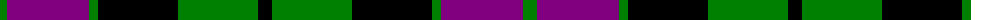
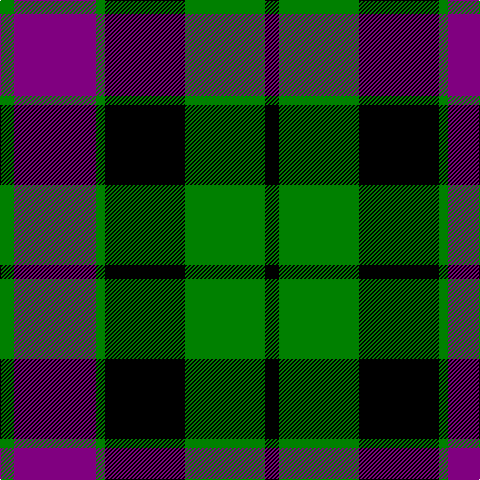

The parent of this is [MacKay, Plaid](/tartans/g/14/p82/g9/k80/g80/k/14/)

This was sourced from weddslist.  It is a [6 stripes tartan](/stripes/stripes6/).

Original link http://www.weddslist.com/cgi-bin/tartans/pg.pl?source=sts

## Thread count
G/14 P82 G9 K80 G80 K/14

## Palette
Each colour and its ΔE from the base-6 reference it is a variant of.

| Colour | Shade | Base | ΔE (OKLab) |
|---|---|---|---|
| G |  `#008000` | G  | 0.09 |
| K |  `#000000` | K  | 0.00 |
| P |  `#800080` | B  | 0.17 |

# Sample pattern

ID: /variants/g/14/p82/g9/k80/g80/k/14-g008000-k000000-p800080/
